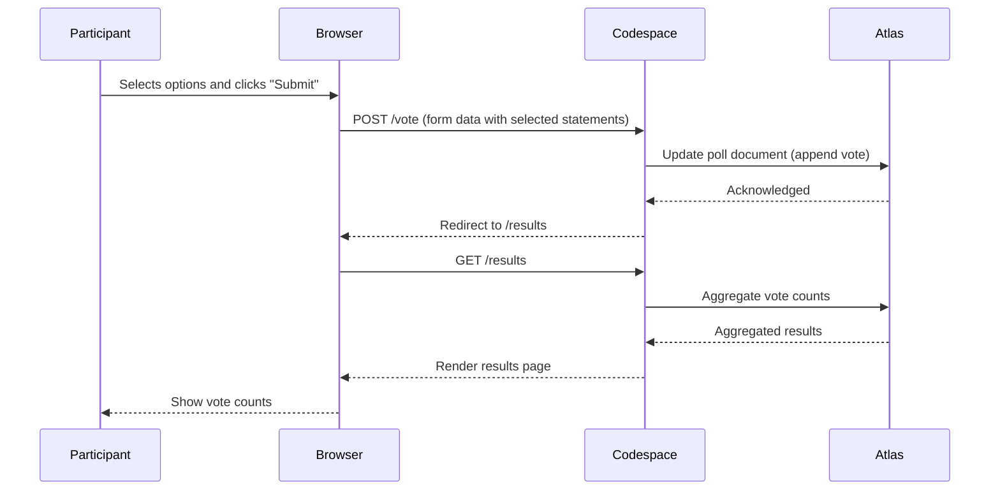
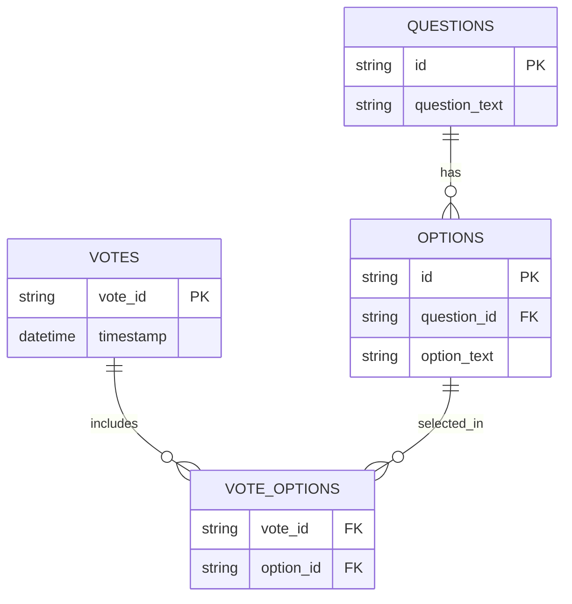
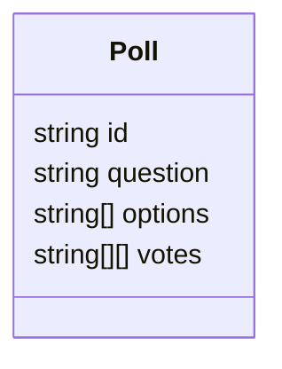
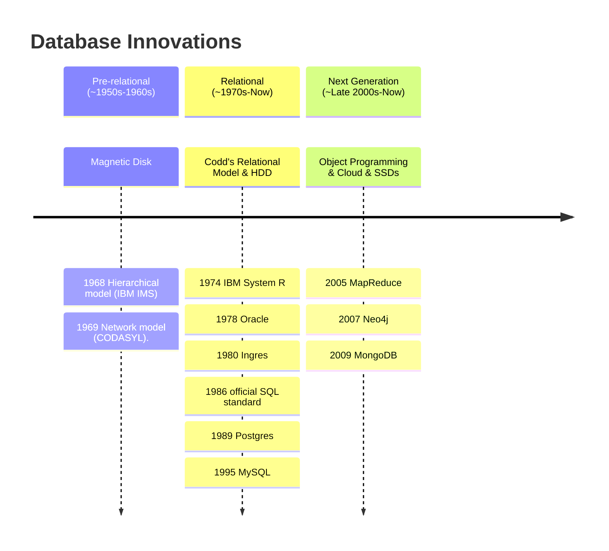

# Course Mock Session Preparation

## Time and Place
The course mock up will be conducted on Tuesday, July 29, 9AM - 10AM in the ABDS classroom (ARC MP163). 

## Mock Session Design Focus
The mock session reviewers will pay attention to the following areas:
- Content & Objectives Alignment
  - Lecture objectives clear and stated?
  - Content aligned with objectives?
- Structure & Flow
  - Logical progression and appropriate pacing?
- Engagement & Delivery
  - Engaging and clear?
  - Are there opportunities for interaction?
  - Do you appear prepared and confident?
- Visuals & Materials
  - Are slides clear, readable, and aligned with the spoken content?
  - Do visuals support learning without overwhelming?
- Active Learning Integration
  - Are active learning strategies (polls, think-pair-share, discussion) effectively integrated?
  

## Session Format

Session time allocation provided by the course support team:
| Time | Activity |
| ---- | -------- |
| 5 min | Setup and technology check |
| 40 min | Your mock lecture delivery |
| 10 min | Feedback discussion |
| 5 min | Wrap-up and next steps |

## Learning Objectives

At the end of this session, participants will be able to:

- **Describe** the historical development and evolution of NoSQL databases in the context of modern data challenges. 
- **Identify** and **explain** real-world scenarios where NoSQL systems are preferred over traditional relational databases. 
- **Compare** different NoSQL data models (e.g., document, key-value, column-family, graph) and recognize popular systems that use each model (e.g., MongoDB, Cassandra, Redis). 

## Course Design

The course will be largely based on the [1-nosql-concept](1-nosql-concept/README.md) module, which covers the history of databases, the evolution of NoSQL systems, and their applications in bioinformatics and data science.

Here is a breakdown of the course design:

1. **Introduction of lecturers and course objectives** (5 minutes)
   - Briefly introduce the lecturers
   - Quick poll on codespace to gauge participants' familiarity with database concepts. [^poll]
   - Go over the result of the quick poll
 
2. **Start the course with the poll as an example of NoSQL application** (5 minutes)
   - Quickly go over the poll results
   - Raise the question: "What have happened"
   - Explain the dataflow of the poll application

3. **Discussion of NoSQL vs SQL with the poll as an example** (10 minutes)
   - Discuss the limitations of SQL databases in handling the poll data
   - Explain how NoSQL databases can address these limitations
   - Use the poll as a case study to illustrate the advantages of NoSQL systems
   - Ask audiences to think, why we start with sql, if nosql is so great?

[^poll]: We build a quick poll hosted on github codespace to collect responses, and use it as an example of a NoSQL application. The lecturers will open [github repo](https://github.com/St-Jude-MS-ABDS/workshop-NoSQL) and run the main branch codespace. Open the codespace with the vscode webeditor, and run `cd 0-mock-session/poll && ./run.sh` to start the poll. The url and QR code will be displayed in the terminal. Participants can scan the QR code or open the URL to access the poll. 
# Lecturer's Notes

This section is for lecturers to remind themselves of what to do during the mock session.

## Diagrams

### Poll workflow

### SQL database scheme: poll as an example

### NoSQL database scheme: poll as an example

### Evolution of Databases

## Before going to the classroom
Ensure the following are ready:
- [ ] USB type-c hub with HDMI output
- [ ] Fully charged laptop, or with power adapter
- [ ] A **live** mongodb instance on atlas. Save the connection string in any way. I will call alias `demodburi` in my terminal and it comes to my clipboard
- [ ] Mongodb network allow `0.0.0.0/0`
- [ ] A github account with access to the [workshop-NoSQL](https://github.com/St-Jude-MS-ABDS/workshop-NoSQL) and still have quota on github codespace. the limit will be 60 hours per month

## In the classroom: preparation
- [ ] Connect the laptop to the projector using the USB type-c hub. Use the screen in Mirror mode.
- [ ] Open the [github repo](https://github.com/St-Jude-MS-ABDS/workshop-NoSQL), open the main branch codespace, put the **tab ONLY** in a new virtual desktop. Let's say, desktop 2. **Change port 8000 visibility to public**. The devcontainer.json will no longer be able to change the visibility. Change it manually under `ports` tab in the codespace. Right click port 8000 and select "Change visibility -> public".
- [ ] Open powerpoint slides in the codespace, and put it in a new virtual desktop. Let's say, desktop 3.
- [ ] Open terminal on mac. We will use it to source `demodburi`

