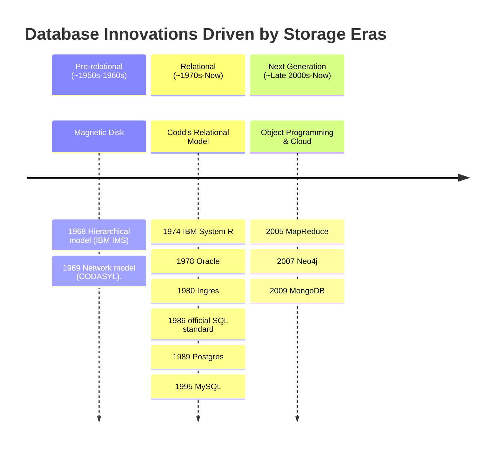
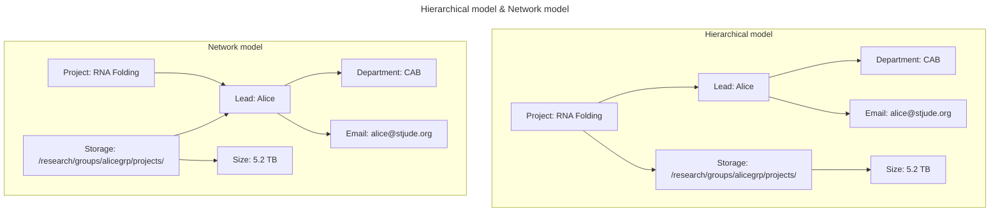
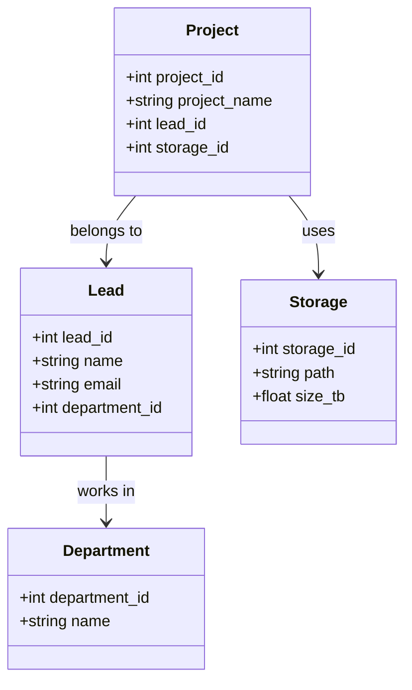

# The course will be given in PowerPoint
# Introduction to NoSQL: Concepts
- [The course will be given in PowerPoint](#the-course-will-be-given-in-powerpoint)
- [Introduction to NoSQL: Concepts](#introduction-to-nosql-concepts)
  - [A brief history of database](#a-brief-history-of-database)
    - [pre-relational database](#pre-relational-database)
    - [Relational Era](#relational-era)
- [Reference](#reference)

## A brief history of database

What's a database?

> _database_ is an organized collection of data -- [wikipedia](https://en.wikipedia.org/wiki/Database)

In this definition, a book is a database, in physical form, and one of the earliest examples of a database. The book is organized in a way that allows you to find information quickly.

> The Hollerith machine and the punch card system was one of the first examples of a digital/mechanical database. The machine was used to process the 1890 US Census, which was the first census to be conducted using a mechanical counting system. The punch card system allowed for the storage and retrieval of census data using mechanical counting machines.

The evolution of databases has been driven by the application demand and the storage media. 

### pre-relational database

The emergence of the magnetic disk enabled the infrastructure of a database:
- You could now seek directly to a particular sector or block.
- This made random access feasible and efficient.
- It allowed databases to scale in complexity without sacrificing access speed.

Two dominant models emerged:
- Hierarchical model (IBM IMS)
- Network model (CODASYL)

Both models are "navigational" in nature, that is, you must navigate from one object to another using **explicitly defined** pointers.

The data schema was fixed in the pre-relational era.

### Relational Era
Edgar Codd published his relational database theory in paper "A Relational Model of Data for Large Shared Data Banks

| Concept | Description |
| ------- | ----------- |
| Table (Relation) | A set of rows and columns, like a spreadsheet. Each table represents an entity (e.g., User, Project). |
| Row (Tuple) | A single record in the table — a complete set of values for one entity instance. |
| Column (Attribute) | A field or property of the entity (e.g., name, email, size_tb). |
| Primary Key (PK) | A unique identifier for each row in a table. |
| Foreign Key (FK) | A reference to the primary key of another table — to link related data. |
| Normalization | A design process to eliminate redundancy and ensure data integrity. |

the relational database are normalized

# Reference
- Next Generation Databases: NoSQL, NewSQL, and Big Data. Guy Harrison, 2015